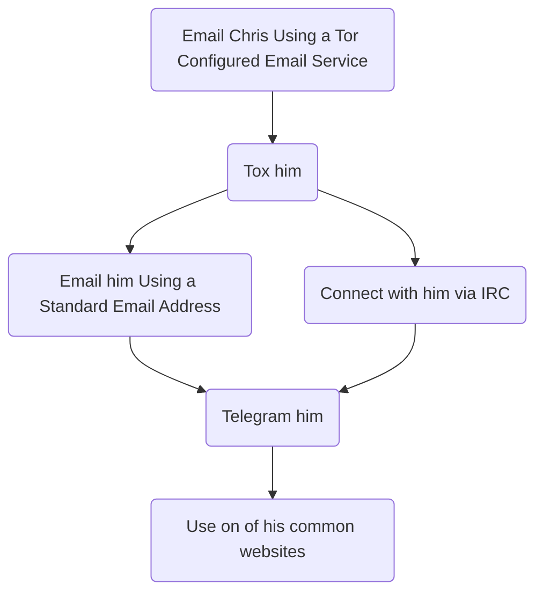

# C | CYBERFACT | Chris

Hi! I am **Chris's** info file. If you want to learn about Chris, you can read me. If you want to talk to Chris, you can [click me](mailto:4d343e13-0b2b-46aa-a76b-f5da2d3c4404@anonaddy.me "Secure Email Address") to email him. Once you have finished with me, simply close me.

# A man of many faces
This is a list of Chris's pseudonyms, organisations, and communities/websites. Obviously, more get added all the time, and I'll try to keep myself updated with what's going on. No promises though.

## Common Usernames
| TOR Sites |  Clearnet |
|---:|:---|
| C | C |
| DNK | DNK |
| Curious | Chris |
| Sokka | Cyberfact |
| DudeOfDarknet | Derman Neill |
| Cyberfact | |
| Chris | |
| Derman Neill | |

## Pseudonyms
Chris uses many Pseudonyms, ones you will encounter occasionally online.
These are different from his **identities** or **usernames**, because these are full people whom he impersonates. However, he will appear online under his **identities/usernames** most often.

 1. Archi Woods
 2. Milo Chapman
 3. Harris Hamilton
 4. Nate Watts
 5. Edwin Baker
 6. Rory Gallagher
 7. Olly Woods
 8. Cassius Woods
 9. Casper Green

## Organisations
Here is a list of the organisations Chris is active in.
 - Company of Silence
 - The Null Network
 - Division Of Misdemeanours
 - Order of Spectres

## Common Sites
[Do Not Know](https://donotknow.tk/ "The Internet Secret") - The Internet Secret
[42745](https://42745.tk/ "Deeper Discussion") - Deeper Discussion
[Deep Discussion](http://u2dobfdtdejffzsira23teluvijaubs3dpdmtihkwvkpekxuvmtss7id.onion/index.php "Deep Discussion (TOR Hidden Service)") - TOR Hidden Service

# Contact

There are a million option if you want Chris. I have been doing my research and I have concluded that this is a concise list of options. If you find out another way to talk to Chris, you can let me know on his site: [DNK](https://donotknow.tk/ "The Internet Secret")

## Email

- Email is by far the largest method of communication worldwide, and as such, Chris has made it easy to contact him using this method.
    > For a **complete list** of addresses to email Chris, check his site: [DNK](https://donotknow.tk/ "The Internet Secret"), although I should have them all here.

- Chris kindly asks that you do not email him stupidly. He's a man who appreciates privacy, as I'm sure you are, and he would appreciate if you contacted him by a secure email service with proper privacy measures taken.

**NOTE: Clearnet users may email any of the email addresses, including the _Anonymous/TOR Addresses_, but TOR accounts should only email the first six listed.**

Ok, so here's the list. The DEFAULT ones are ones he prefers to use, but as far as I am aware he checks them all now and then.
### Anonymous/TOR Addresses:

>[4d343e13-0b2b-46aa-a76b-f5da2d3c4404@anonaddy.me](mailto:4d343e13-0b2b-46aa-a76b-f5da2d3c4404@anonaddy.me) (DEFAULT)

>[9ec974b8-1928-4c55-ad83-b95c9a159d06@anonaddy.me](mailto:9ec974b8-1928-4c55-ad83-b95c9a159d06@anonaddy.me) (DEFAULT)

### Clearnet/OpenIdentity Addresses:
>[42745@tuta.io](mailto:42745@tuta.io) (DEFAULT)
>[cyberfact@pm.me](mailto:cyberfact@pm.me) (DEFAULT)

>[donotknow@null.net](mailto:donotknow@null.net)

## Other Platforms
Obviously, communication isn't limited to email. You can communicate with Chris via his website \[[DNK](https://donotknow.tk "The Internet Secret")\]

### Tox

If you have qtox or utox, great! Chris is available for communication there.

>991A7E0F4E1504E21E0F2DAA988539AD3E89D3AB6F1E6901C6F094E8844B6723488CC131EC9F

Please use responsibly. **Never text using Antidote** or another mobile client for Tox. It is not safe.

### IRC
Chris has a few IRC Channels that he looks at frequently. He owns all of them, and welcomes you to look around.

>Matrix - Using Riot IM
>>>Chanel: `donotknow:matrix.org`
>>>Community: `+nullnet:matrix.org`
>
>Freenode - Any IRC Client
>>`#donotknow.tk`
>>`#42745`
>>`#thenullnetwork`
>>`#cosilence`
>
>OFTC- Any IRC Client
>>`#donotknow.tk`
>>`#42745`
>>`#thenullnetwork`
>>`#null.net`
>>`#cosilence`

Ok, almost there. If email, Tox and IRC aren't enough for you, there's still more. You can contact him on any three of his sites mentioned above under the *Common Sites* heading.

### Telegram
Chris also uses Telegram. He is available at the username <code>@CYB3RFACT</code>.

In general - try to follow the structure below when contacting Chris, trying the first thing first and the last thing last.

Try not to use the last one - LEA can easily pick up your message. Use the TOR hidden service one if you need to contact Chris that way - although sometimes it will be down.

### Gitter

Click the button above. It's simple way to talk to Chris via the Gitter chat platform @ [The Null Network/donotknow](https://gitter.im/thenullnetwork/donotknow?utm_source=share-link&utm_medium=link&utm_campaign=share-link) channel.

I take my job of being an information file very seriously. **But please _don't be stupid_!**

# PGP Key

<pre><mono>
-----BEGIN PGP PUBLIC KEY BLOCK-----

mQENBFzoIhYBCAC4RppubV8h+rO/x6b9hROo2jpl9ZAg7yRzgfdaoK9iQosjGroa
bnQDoM9B+gq3q+DuXnFXdTRhrCFuJFUrD3x8rCKB7Vc8BGomCM/9i6u3ohS0tQFC
jMA0CQ9yGgnJsJZ3DGMOOuJmEvnxitxwoSqc3PVPqCNWXZuLUdX/aYdZ3Q9zzgwV
L2rWwJtje+wqRCjU93OvEqynfVoI5FuNo5pheSSabxLoNX0QeGMJaDWvi/8hArj3
diDvZIXgMy4gC7UUvwcU5Zy1Cem7qpt/8e5asJXqzfmjmfzH+zzramG/KfTadRzw
XK5oBl3UGnEYIwkDOaq1D9hvo9/Y9TV/topHABEBAAG0DS0tLS0tIDwtLUAtLT6J
AU4EEwEIADgCGwMFCwkIBwIGFQoJCAsCBBYCAwECHgECF4AWIQQ9L1B54tUkgIVn
HaPOhQjAHLEC7QUCXVKukQAKCRDOhQjAHLEC7S0UB/45bSuFM/EAX6yX4O64Xtui
iK6a5MdQtdwf5yH/tsGRxVLpjokSRVampjNQXaZzZ4RmQpwaHfL+IBEY7mVIgafI
wMlFptNrGGhLrEld0vW3dCjTQD97G2k7nkiVevFfujx+WU0Owxhb2YtGHHcjMF4Z
ofReicnxyaLjyt+8Lsx+ejAmBYOIN5W318Nd4sxWUOSTV/80ZeCUdkJhEmennYi0
gGtgJx9jvZ9HjIv3htf/tRBhzErH9EuLqB1X4ceO1XMwXybSCByoD61vTF0qZvKi
VB4PMA9dKy3smKZH9a4/s1lsqRwLSdEMFc+4AKu/RDo8u+uE9Spe15IlwArsY7ow
iQFOBBMBCAA4AhsDBQsJCAcCBhUKCQgLAgQWAgMBAh4BAheAFiEEPS9QeeLVJICF
Zx2jzoUIwByxAu0FAl1S2NgACgkQzoUIwByxAu3ayAf+MlWK6BQyEsqihzbH4mzk
1ZaG2ELr5+qN4yX1/a8EOcPar+IcP5/Cn7Lcg9I7uROp+BbzwOV6eNQn1Yeljqmo
89KpriBbroCcNa1M2M5/asMU0yWnk8EV5tlGaYn2+5M91bal6UzhfPCdRlvBQ3Gu
gskcUv3+r/lqEzgyuHEccz9YeT82W5wCO2smmYss2o35aFk9A75QO1meD6wY25ZI
aH4KK3xYf1XKUEkVwfA9qkKf0afG6RNkDtHPaSsVDNDAkhzhdNZm1bgOHKXmNYqq
iMmuxHTonFb7WinJUnV04xRp1s9GXgxkDt5qH5LmPUWTLIsuSOBRgQPFdzoiJ42t
NrkBDQRc6CIWAQgAvezjJ8BqI0hFSqNAvfYbo3SLlzAxGEuLzCu+A4MFbgzsuDfD
1P7Qj8yz+d9G1+kdC6qRJlo3LyEqAGGBrjCDjBsza1fSXBP6lLKWrw+mEsPZUj1G
S/jmQCB++TikR0NUcnu14mu0uHVu03+ikc428+AcA6nL+n2cdrh8WV2oxvmKaAwg
zGXFLHhgYo81BMowN+TDafR7B8O60FHAyAX33TGgPaLx2f4ZXMXAPJ/D/+tD/yDV
MmUByt1hhaMNOHEtyE1G1260TQMIYubbfxBdY7kpjabMI/Zu+NHjahJKHysBwds0
+J/V7P9dQFkpMpISOkJAu3Q7AAzUi0/v+I9jVQARAQABiQE8BBgBCAAmFiEEPS9Q
eeLVJICFZx2jzoUIwByxAu0FAlzoIhYCGwwFCQPDZRoACgkQzoUIwByxAu2tIAgA
iLSf1PwcXL/YPSVO+ARcQLT3H4y8FvpABzkSaWoJKd73UCqCRRAGdr996+6X6cOy
ziagavycc5jNEUeI9lPlM1RjuP+KQeg5BFFAc2NZXrPN5tSWVvzx1Oc+TOPsqNL1
BPNYrWfLjau5oPuYFh76mfnwcam29/Jiu4NwtBocv+DT2ZUvFIX/zmN3z1o2Dc27
funwSmOVam4CEMfJpIaYTJPn22gPE988lvP9TICEYs+nRG69j6Kv8Ij6UAtMSUbX
RWaVd3uI2o5xg8SncBlqt3yB+XKEwmPBoioAO1SMAX8DYYKaEvpRIn+FF3Uw++mV
5kUsm6q2K3+TcYuyhbR9iA==
=JVnr
-----END PGP PUBLIC KEY BLOCK-----
</mono></pre>

[Or download here.](3D2F5079E2D5248085671DA3CE8508C01CB102ED.asc)

___
# Important things to note:

Looking to learn a little bit about the man? There's a lot to him. He can be found at pretty much any corner of the internet. He is an active Clearnet (or Surfacenet for you hardcore computer scientists), Tor, and Freenet user. He works hard on balancing his computer life with his real one. He loves making new friends, both online and in real life, and participates in a staggeringly wide range of activities. Tennis, chess, parkour, he does it all. He uses his keen eye to brighten up the world with his photography and occasionally writes screenplays, novels, and poetry. Here are some important facts about Chris though.

## Chris is not a paedophile

Chris explores the ins and outs of the internet, and as part of the exploration, he comes across sites that facilitate child pornography. There are forums, group chats, and various other mediums where child abuse content can be found.

Chris in no way supports anything that hurts or exploits children.

## Chris is not a criminal
Chris tries to stay as legal as possible. He doesn't participate in the trafficking of money, drugs, weapons, humans or children. He doesn't even support them. He's just smart enough to know that he can't stop them. He doesn't support anything illegal, he's just too lazy to do anything about it.

## Chris can help
If you need help with anything that doesn't require money, Chris wants to help. If you're lonely, attracted to animals, only four foot tall, and you want to talk about your issues, Chris is happy to help. If you need relationship advice, accidentally killed a guy, or grieving the death of a recent loss, Chris is the go-to guy. If you do talk to him, don't get Chris involved in anything that could hurt him or violate his safety otherwise. He has a good thing going.

Similarly, if you have committed a crime, and you need help, Chris will hear you out. He can try to help you find a solution to whatever problem you may have, or help you rectify the situation and make thing right. If you have committed a serious crime (i.e. a crime against the human (murder, rape, assault), Chris will have to consider his legal responsibilities as well. **Don't ever** give identifiable information to Chris unless you have some planned course of action.

# The end
This is all I can help you with now. I hope I was informative enough. Bye. :)
